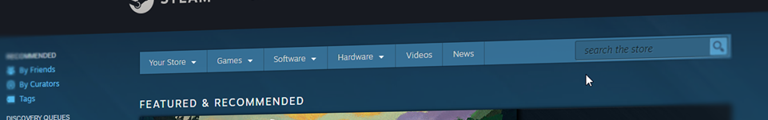

# DedicatedSlave

DedicatedSlave is a shell tool for bootstrapping game servers

> A cross platform desktop app tool to manage steam dedicated game servers with SteamCMD.

Create, Config and Launch your steam dedicated game server on the fly.

Visit [Website](https://dedicatedslave.readthedocs.io/) for more information

* [Getting Started](http://dedicatedslave.readthedocs.io/en/latest/user-guide/gettingstarted/)
* [Changelog](http://dedicatedslave.readthedocs.io/en/latest/about/release-notes/)

***

## How to install
- clone the repo: `git clone https://gitlab.com/enthdev/dedicatedslave.git`
- prepare the environment: `source build/env.sh`
- install everything: `brunch install`

## Dependencies
- [DUB](https://code.dlang.org/), the D package registry
- A [D Compiler](https://dlang.org/download.html)
- [GTK+](https://www.gtk.org/) (for graphical user interface)
- lib32gcc1

## ..

* https://github.com/gtkd-developers/GtkD/tree/master/demos/gtkD
* https://developer.gnome.org/gtk3/stable/
* https://api.gtkd.org/gtkd/gtk/MainWindow.html
* https://sites.google.com/site/gtkdtutorial/
* https://archive.dpldocs.info/archive.html
* https://developer.gnome.org/icon-naming-spec/
* https://specifications.freedesktop.org/icon-naming-spec/icon-naming-spec-latest.html
* https://developer.gnome.org/gtk3/stable/gtk3-Stock-Items.html
* https://developer.gnome.org/gtk3/stable/gtk3-Themeable-Stock-Images.html

## Chocolatey

Run the following command from an elevated command shell.

* [dub](https://chocolatey.org/packages/dub)
* [dmd](https://chocolatey.org/packages/dmd)
* [ldc](https://chocolatey.org/packages/ldc)

https://gtkd.org/Downloads/runtime/gtk3-runtime_3.22.24-1_64bit.exe

## Support

Creating this app takes a lot of time. Unlike others softwares,
DedicatedSlave is completely independently funded.

Contact [EnthDev](https://github.com/EnthDev) (<enthdev@outlook.com>) for more information.

## Development and Contributing

Feel free to send pull requests and raise issues.

Please read [Contributing Guidelines](http://dedicatedslave.readthedocs.io/en/latest/developer-guide/contributing/) for details about the process for submitting pull requests to us.

## License

[MIT](https://opensource.org/licenses/MIT) [License](LICENSE)

***

This document was written with [Markdown](http://daringfireball.net/projects/markdown/), [GitHub Flavored Markdown](https://guides.github.com/features/mastering-markdown/) and [Emoji](http://www.webpagefx.com/tools/emoji-cheat-sheet/). :smile: