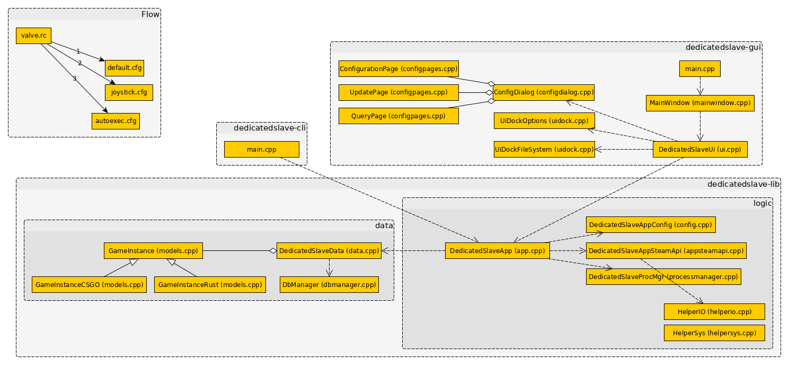

# Developer Guide

This is a guide for who want to dev

---

## Installation

Dependencies:

* [DUB](https://code.dlang.org/), the D package registry
* A [D Compiler](https://dlang.org/download.html)
* [GTK+](https://www.gtk.org/) (for graphical user interface)

### Ubuntu

1. Using git, clone the repository

```
git clone --depth=1 https://gitlab.com/enthdev/dedicatedslave.git dedicatedslave
```

### Windows

https://gstreamer.freedesktop.org/data/pkg/windows/

> You better know what you are doing !!!

1. Using an elevated cmd or powershell command shell, install [dub](https://chocolatey.org/packages/dub), [~~dmd~~](https://chocolatey.org/packages/dmd), [ldc](https://chocolatey.org/packages/ldc) via chocolatey.

```
choco install dub ldc
```

2. Download GtkD Gtk3 Runtime from [here](https://gtkd.org/Downloads/runtime/gtk3-runtime_3.22.24-1_64bit.exe) and install it.
3. Using [Git bash](https://git-scm.com/downloads) or other git compatible shell, clone the repository

```
git clone --depth=1 https://gitlab.com/enthdev/dedicatedslave.git dedicatedslave
```

## Build

### Windows

```bash
cd dedicatedslave
call build\env.cmd db
```

### Unix

```bash
cd dedicatedslave
source build/env.sh
b
```

## Run

### Windows

```bash
cd dedicatedslave
call build\env.cmd ds
```

### Unix

```bash
cd dedicatedslave
source build/env.sh
s
```

## Testing

...

## Countinous Integration

...

## Flow Diagram



## Roadmap

* Game Instances Custom Options
  * CSGO
    * ESL Config
    * Plugins
      * Zombies
* Config
* Verify if any folder exist and is not in db
* Update system
* Documentation (Doxygen ??)
* Colors Output Stdout

## Documentation

* [GtkD API](https://api.gtkd.org/gtkd/gtk/MainWindow.html)
* [GtkD API Experimental](http://dpldocs.info/experimental-docs/gtk.ToolButton.ToolButton.html)
* [gtkd-developers/GtkD](https://github.com/gtkd-developers/GtkD/)
* [Gtk3 Developer Gnome](https://developer.gnome.org/gtk3/stable/)
  * https://developer.gnome.org/gtk3/stable/gtk3-Stock-Items.html
  * https://developer.gnome.org/gtk3/stable/gtk3-Themeable-Stock-Images.html
* https://sites.google.com/site/gtkdtutorial/
* Modules
  * https://archive.dpldocs.info/archive.html
* Icon Naming
  * https://developer.gnome.org/icon-naming-spec/
  * https://specifications.freedesktop.org/icon-naming-spec/icon-naming-spec-latest.html
* GameInstances
  * Rust
    * https://developer.valvesoftware.com/wiki/Rust_Dedicated_Server
    * http://facepunch.github.io/webrcon
    * https://quantumsoftware.co.za/index.php?resources/rust-server-manager.3/