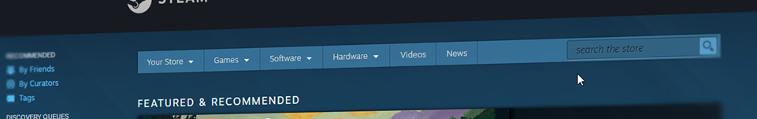

# Dedicated Slave

A cross platform desktop app tool to manage steam dedicated game servers with&nbsp;SteamCMD

---

## Overview

DedicatedSlave is a cross platform tool for bootstrapping game servers. Allows you to start/stop/update/create/delete/backup/restore game instances.

With DedicatedSlave creating game servers is not a problem.n You can create as many servers as you want.

DedicatedSlave allow you to config game servers with a simple file.

Allow you to quickly launch any server from any platform.

## Supported Platforms

### Screenshoots

